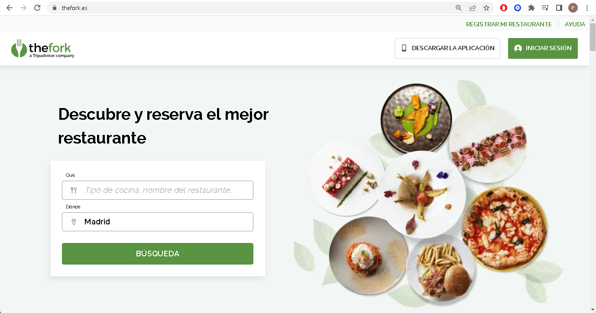
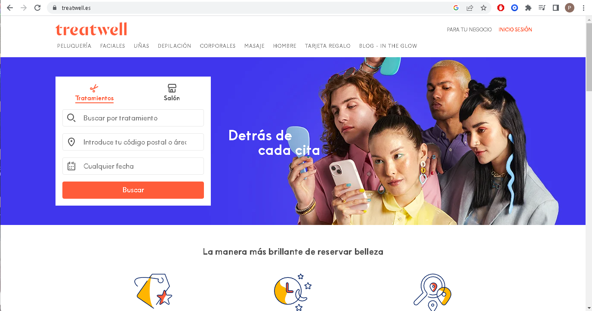
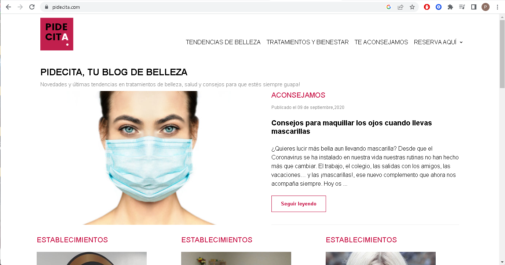
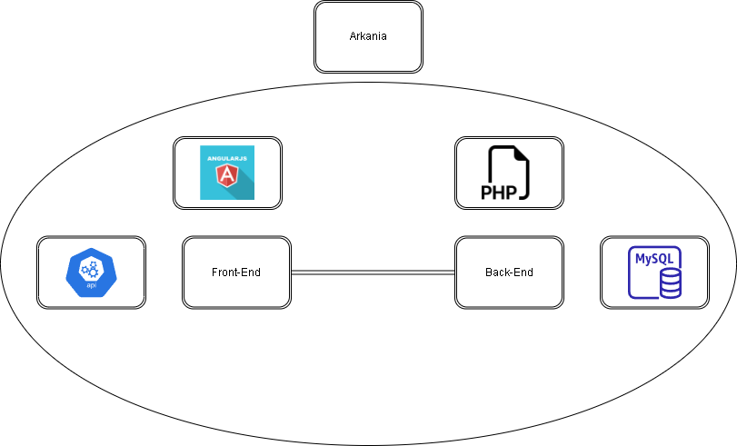

# Preliminary Project - BookMe

## Index
- **[Problem Description](#problem-description)**
- **[Objective](#objective)**
- **[Architecture and Technologies to be Used](#architecture-and-technologies-to-be-used)**
- **[Solution Sketch](#solution-sketch)**

### Problem Description

After a preliminary search on the web, we found several similar applications, however, most of them only offer the possibility of 
making reservations for a specific service, as we can see in the following images.

  
[The Fork](https://www.thefork.es/)

  
[Treatwell](https://www.treatwell.es/)
  

  
[PideCita](https://www.pidecita.com/)
  
Therefore, we have concluded that, although the idea already existed previously, we believe we could improve the types of services that can be reserved of different types such as restaurants, hairdressers, etc. In addition to improving both the visual and functional aspects to make it easier for customers to make reservations and easier to manage and organize them.

### Objective

The objective of this project is to create an online booking platform that simplifies and automates the booking process for service companies. We allow customers to book services online anytime and from anywhere, saving time and improving the customer experience. The platform is user-friendly and can be customized according to each business's specific needs. We help businesses improve their efficiency and reduce costs by eliminating the need to manually coordinate appointments and bookings with customers.

### Architecture and Technologies to be Used
  
We will use the following technologies for the project:

- For the back-end: We will use PHP.
  
- For the front-end: We will use Angular.
  
- For the database: We will use MySQL.
  
- We will use one or more Rest APIs that we will create ourselves.
  
- For the application deployment, we will use nginx on our Arkania virtual machine.

### Solution Sketch

