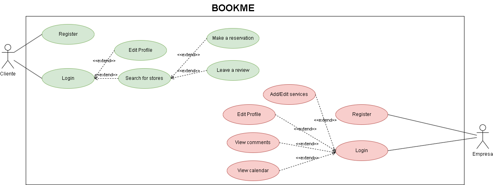

  
This is the use case diagram for our application, which describes the possible actions of users within the application.
  

  

  
# Actor Specification

This document specifies the different actors involved in the proposed solution.

## Client

| Actor | Client |
| --- | --- |
| Description | Application client who can make reservations |
| Characteristics |  |
| Relationships |  |
| References | Register, Login, Edit profile, Search for location, Make reservation, Leave review |
| Notes |  |
| Author | Pablo Rodríguez de la Sierra García |
| Date | 09/03/2023 |

## Company

| Actor | Company |
| --- | --- |
| Description | Company that can add their location and information to the application |
| Characteristics |  |
| Relationships |  |
| References | Register, Login, Edit profile, Respond to reviews, View calendar |
| Notes |  |
| Author | Pablo Rodríguez de la Sierra García |
| Date | 09/03/2023 |
 
 ## Administrator

| Actor | Administrator |
| --- | --- |
| Description | Application administrator |
| Characteristics |  |
| Relationships |  |
| References | Login, Disable account, Resolve doubts/problems, Enable account |
| Notes |  |
| Author | Pablo Rodríguez de la Sierra García |
| Date | 09/03/2023 |
  

  
# Use Case Specification

## Register

| Use Case UC | Register |
| --- | --- |
| Actor | Client |
| Description | The client can register in the application |
| Basic Flow | The client registers taking into account that they are not already registered |
| Preconditions | Not registered |
| Postconditions |  |
| Requirements | Not registered |
| Notes |  |
| Author | Pablo Rodríguez de la Sierra García |
| Date | 09/03/2023 |

## Login

| Use Case UC | Login |
| --- | --- |
| Actor | Client |
| Description | The client can log in to the application |
| Basic Flow | After having previously registered, the client will log in to the application |
| Preconditions | Registered |
| Postconditions |  |
| Requirements | Registered |
| Notes |  |
| Author | Pablo Rodríguez de la Sierra García |
| Date | 09/03/2023 |

## Edit Profile

| Use Case UC | Edit profile |
| --- | --- |
| Actor | Client |
| Description | The client can make changes to their user profile information |
| Basic Flow | After logging in, the client can make changes to their profile information |
| Preconditions | Logged in |
| Postconditions |  |
| Requirements | Logged in |
| Notes |  |
| Author | Pablo Rodríguez de la Sierra García |
| Date | 09/03/2023 |

## Search for Location

| Use Case UC | Search for Location |
| --- | --- |
| Actor | Client |
| Description | The client can search for a location |
| Basic Flow | After logging in, the client can search for a location |
| Preconditions | Logged in |
| Postconditions |  |
| Requirements | Logged in |
| Notes |  |
| Author | Pablo Rodríguez de la Sierra García |
| Date | 09/03/2023 |

## Make Reservation

| Use Case UC | Make Reservation |
| --- | --- |
| Actor | Client |
| Description | The client can make a reservation for a specific time |
| Basic Flow | After searching for a location, the client can make a reservation |
| Preconditions | Have searched for the desired location |
| Postconditions |  |
| Requirements | Have logged in |
| Notes |  |
| Author | Pablo Rodríguez de la Sierra García |
| Date | 03/09/2023 |

## Leave Review

| Use Case UC | Leave Review |
| --- | --- |
| Actor | Client |
| Description | The client can leave a review about a specific location |
| Basic Flow | After searching for a location, the client can leave a review |
| Preconditions | Have searched for the location |
| Postconditions |  |
| Requirements | Have logged in |
| Notes |  |
| Author | Pablo Rodríguez de la Sierra García |
| Date | 03/09/2023 |

## Register

| Use Case UC | Register |
| --- | --- |
| Actor | Company |
| Description | The company can register in the application |
| Basic Flow | The company registers taking into account that it is not already registered |
| Preconditions | Not be registered |
| Postconditions |  |
| Requirements | Not be registered |
| Notes |  |
| Author | Pablo Rodríguez de la Sierra García |
| Date | 03/09/2023 |

## Log In

| Use Case UC | Log In |
| --- | --- |
| Actor | Company |
| Description | The company can log in to the application |
| Basic Flow | After having previously registered, it will log in to the application |
| Preconditions | Be registered |
| Postconditions |  |
| Requirements | Be registered |
| Notes |  |
| Author | Pablo Rodríguez de la Sierra García |
| Date | 03/09/2023 |

## Edit Profile

| Use Case UC | Edit Profile |
| --- | --- |
| Actor | Company |
| Description | The company can make changes to its profile data |
| Basic Flow | After logging in, the company can make changes to its profile data |
| Preconditions | Have logged in |
| Postconditions |  |
| Requirements | Have logged in |
| Notes |  |
| Author | Pablo Rodríguez de la Sierra García |
| Date | 03/09/2023 |

## Respond to Reviews

| Use Case UC | Respond to Reviews |
| --- | --- |
| Actor | Company |
| Description | The company can respond to customer reviews |
| Basic Flow | After logging in, the company can respond to customer reviews |
| Preconditions | Have reviews |
| Postconditions |  |
| Requirements | Have logged in |
| Notes |  |
| Author | Pablo Rodríguez de la Sierra García |
| Date | 03/09/2023 |

## View Calendar

| Use case UC | View Calendar |
| --- | --- |
| Actor | Company |
| Description | The company can review their daily reservations |
| Basic flow | After logging in, the company can review their daily reservations |
| Pre-conditions | To have logged in |
| Post-conditions |  |
| Requirements | To have logged in |
| Notes |  |
| Author | Pablo Rodríguez de la Sierra García |
| Date | 09/03/2023 |
  

## Log In

| Use case UC | Log In |
| --- | --- |
| Actor | Administrator |
| Description | The administrator can log in to the application |
| Basic flow | After having previously registered, they will log in to the application |
| Pre-conditions | To be registered |
| Post-conditions |  |
| Requirements | To be registered |
| Notes |  |
| Author | Pablo Rodríguez de la Sierra García |
| Date | 09/03/2023 |
  
## Deactivate Account

| Use case UC | Deactivate Account |
| --- | --- |
| Actor | Administrator |
| Description | The administrator can deactivate a user's account in the application |
| Basic flow | After the user has previously registered, the administrator can deactivate their account |
| Pre-conditions | The user is registered |
| Post-conditions |  |
| Requirements | The user is registered |
| Notes |  |
| Author | Pablo Rodríguez de la Sierra García |
| Date | 09/03/2023 |

## Activate Account

| Use case UC | Activate Account |
| --- | --- |
| Actor | Administrator |
| Description | The administrator can activate a user's account in the application |
| Basic flow | The administrator can activate a user's account |
| Pre-conditions | The user is not registered |
| Post-conditions |  |
| Requirements | The user is not registered |
| Notes |  |
| Author | Pablo Rodríguez de la Sierra García |
| Date | 09/03/2023 |
  
## Solve Doubts/Issues

| Use case UC | Solve Doubts/Issues |
| --- | --- |
| Actor | Administrator |
| Description | The administrator can solve doubts or issues raised by users |
| Basic flow | The administrator can solve doubts or issues raised by users |
| Pre-conditions |  |
| Post-conditions |  |
| Requirements |  |
| Notes |  |
| Author | Pablo Rodríguez de la Sierra García |
| Date | 09/03/2023 |
  

  
[← Back to documentation](../../doc)
  

