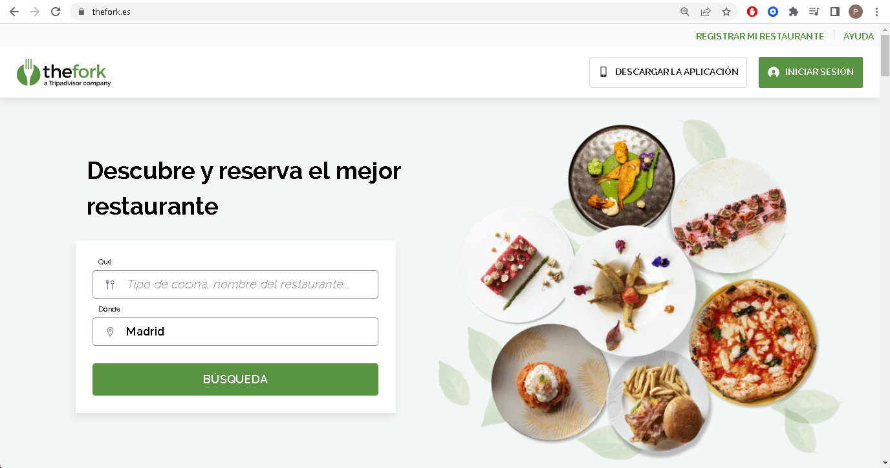
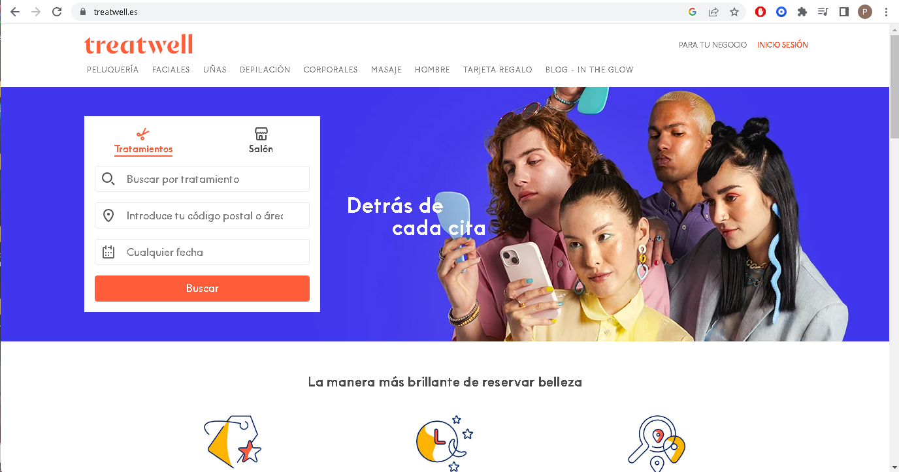
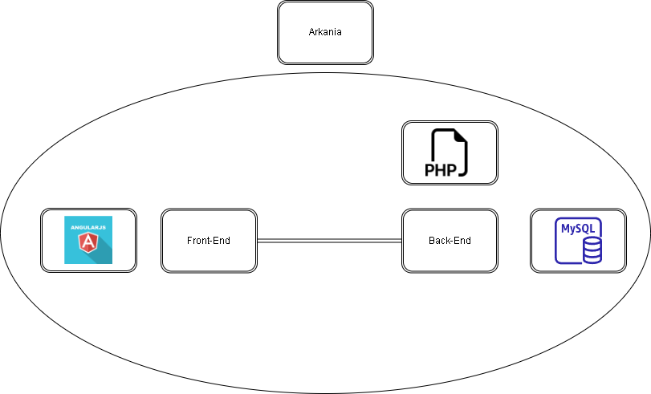

# Anteproyecto - BookMe

## Indice
- **[Descripción del problema](#descripción-del-problema)**
- **[Objetivo](#objetivo)**
- **[Arquitectura y tecnologías a utilizar](#arquitectura-y-tecnologías-a-utilizar)**
- **[Boceto de la solución](#boceto-de-la-solución)**
### Descripción del problema.

Después de una búsqueda preliminar por la red hemos encontrado varias aplicaciones similares, sin embargo, en su gran mayoría estás aplicaciones solo ofrecen la posibilidad de realizar reservas a un servicio en concreto, como podremos comprobar en las siguientes imágenes.

  
[The Fork](https://www.thefork.es/)

  
[Treatwell](https://www.treatwell.es/)
  

  
[PideCita](https://www.pidecita.com/)
  
Por ello hemos concluido que, aunque la idea ya exisitía previamente, creo que podríamos mejorar los tipos de servicios que se puedan reservar de diferentes tipos como por ejemplo: restaurantes,peluquerías,etc. Además de mejorar tanto en el aspecto visual como en el funcional para hacer más sencillo la reserva para los clientes y más sencillo llevar las reservas y la organización de las mismas.
  
### Objetivo.

Este proyecto tendrá como objetivo crear una plataforma de reservas en línea que simplifica y automatiza el proceso de reservas para empresas de servicios. Permitimos que los clientes reserven servicios en línea en cualquier momento y desde cualquier lugar, lo que ahorra tiempo y mejora la experiencia del cliente. La plataforma es fácil de usar y se puede personalizar según las necesidades específicas de cada negocio. Ayudamos a las empresas a mejorar su eficiencia y a reducir costos al eliminar la necesidad de coordinar manualmente las citas y reservas con los clientes.

### Arquitectura y tecnologías a utilizar.
  
Para la realización del proyecto usaremos las siguientes tecnologías:

- Para el back-end: Usaremos PHP.
  
- Para el front-end: Usaremos Angular.
  
- Para la base de Datos: Usaremos MySQL.
  
- Usaremos uno o varios Api Rest que crearemos nosotros mismos.
  
- Para el despliegue de la aplicación usaremos nginx en nuestra máquina virtual de arkania.

### Boceto de la solución

[← Volver a la documentación](../../doc)

