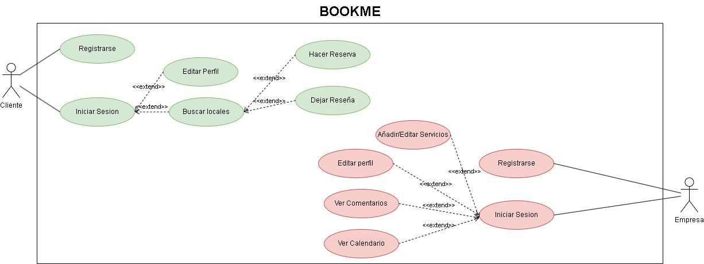

  
Este es el diagrama de casos de uso sobre nuestra aplicación, en ella se encuentra una descripción de las posible acciones de los usuarios dentro de la aplicación
  

  

  
# Especificación de Actores

En el presente documento se realiza la especificación de los diferentes actores que intervienen en la solución propuesta.

## Cliente

| Actor | Cliente |
| --- | --- |
| Descripción | Cliente de la aplicación que puede realizar reservas|
| Características |  |
| Relaciones |  |
| Referencias | Registrarse, Iniciar Sesion, Editar perfil, Buscar Local, Hacer Reserva, Dejar Reseña |
| Notas |  |
| Autor | Pablo Rodríguez de la Sierra García |
| Fecha | 09/03/2023 |

## Empresa

| Actor | Empresa |
| --- | --- |
| Descripción | Empresa que puede añadir su local y su información en la aplicación|
| Características |  |
| Relaciones |  |
| Referencias | Registrarse, Iniciar Sesion, Editar perfil, Responder Reseñas, Ver Calendario |
| Notas |  |
| Autor | Pablo Rodríguez de la Sierra García |
| Fecha | 09/03/2023 |
 
 ## Administrador

| Actor | Administrador |
| --- | --- |
| Descripción | Administrador de la aplicación|
| Características |  |
| Relaciones |  |
| Referencias | Iniciar Sesion, Dar de Baja, Resolver Dudas/Problemas, Dar de Alta |
| Notas |  |
| Autor | Pablo Rodríguez de la Sierra García |
| Fecha | 09/03/2023 |
  

  
# Especificación de Casos de Usos

## Registrarse

| Caso de Uso CU | Registrarse |
| --- | --- |
| Actor | Cliente |
| Descripción | El cliente se podrá registrar en la aplicación |
| Flujo básico | El cliente se registra teniendo en cuenta de que no lo esté ya |
| Pre-condiciones | No estar registrado |
| Post-condiciones |  |
| Requerimientos | No estar registrado |
| Notas |  |
| Autor | Pablo Rodríguez de la Sierra García |
| Fecha | 09/03/2023 |

## Iniciar Sesión

| Caso de Uso CU | Iniciar Sesion |
| --- | --- |
| Actor | Cliente |
| Descripción | El cliente podrá iniciar sesión en la aplicación |
| Flujo básico | Tras haberse registrado anteriormente iniciará sesión en la aplicación |
| Pre-condiciones | Estar registrado |
| Post-condiciones |  |
| Requerimientos | Estar registrado |
| Notas |  |
| Autor | Pablo Rodríguez de la Sierra García |
| Fecha | 09/03/2023 |

## Editar perfil

| Caso de Uso CU | Editar perfil |
| --- | --- |
| Actor | Cliente |
| Descripción | El cliente podrá realizar cambios en los datos del perfil del usuario |
| Flujo básico | Tras haber iniciado sesión el cliente puede realizar cambios en los datos de su perfil|
| Pre-condiciones | Haber iniciado sesión |
| Post-condiciones |  |
| Requerimientos | Haber iniciado sesión |
| Notas |  |
| Autor | Pablo Rodríguez de la Sierra García |
| Fecha | 09/03/2023 |

## Buscar Local

| Caso de Uso CU | Buscar Local |
| --- | --- |
| Actor | Cliente |
| Descripción | El cliente podrá buscar un local |
| Flujo básico | Tras haber iniciado sesión el cliente puede buscar un local|
| Pre-condiciones | Haber iniciado sesión |
| Post-condiciones |  |
| Requerimientos | Haber iniciado sesión |
| Notas |  |
| Autor | Pablo Rodríguez de la Sierra García |
| Fecha | 09/03/2023 |

## Hacer Reserva

| Caso de Uso CU | Hacer Reserva |
| --- | --- |
| Actor | Cliente |
| Descripción | El cliente podrá hacer una reserva a una hora en concreto|
| Flujo básico | Tras haber buscado un local el cliente puede hacer una reserva|
| Pre-condiciones | Haber buscado el local que se desea reservar|
| Post-condiciones |  |
| Requerimientos | Haber iniciado sesión |
| Notas |  |
| Autor | Pablo Rodríguez de la Sierra García |
| Fecha | 09/03/2023 |
  
## Dejar Reseña

| Caso de Uso CU | Dejar Reseña |
| --- | --- |
| Actor | Cliente |
| Descripción | El cliente podrá dejar una reseña sobre un local en concreto|
| Flujo básico | Tras haber buscado un local el cliente puede hacer una reseña|
| Pre-condiciones | Haber buscado el local|
| Post-condiciones |  |
| Requerimientos | Haber iniciado sesión |
| Notas |  |
| Autor | Pablo Rodríguez de la Sierra García |
| Fecha | 09/03/2023 |
  

 
## Registrarse

| Caso de Uso CU | Registrarse |
| --- | --- |
| Actor | Empresa |
| Descripción | La empresa se podrá registrar en la aplicación |
| Flujo básico | La empresa se registra teniendo en cuenta de que no lo esté ya |
| Pre-condiciones | No estar registrado |
| Post-condiciones |  |
| Requerimientos | No estar registrado |
| Notas |  |
| Autor | Pablo Rodríguez de la Sierra García |
| Fecha | 09/03/2023 |

## Iniciar Sesión

| Caso de Uso CU | Iniciar Sesion |
| --- | --- |
| Actor | Empresa |
| Descripción | La empresa podrá iniciar sesión en la aplicación |
| Flujo básico | Tras haberse registrado anteriormente iniciará sesión en la aplicación |
| Pre-condiciones | Estar registrado |
| Post-condiciones |  |
| Requerimientos | Estar registrado |
| Notas |  |
| Autor | Pablo Rodríguez de la Sierra García |
| Fecha | 09/03/2023 |

## Editar perfil

| Caso de Uso CU | Editar perfil |
| --- | --- |
| Actor | Empresa |
| Descripción | La empresa podrá realizar cambios en los datos del perfil |
| Flujo básico | Tras haber iniciado sesión la empresa puede realizar cambios en los datos de su perfil|
| Pre-condiciones | Haber iniciado sesión |
| Post-condiciones |  |
| Requerimientos | Haber iniciado sesión |
| Notas |  |
| Autor | Pablo Rodríguez de la Sierra García |
| Fecha | 09/03/2023 |

## Responder Reseñas

| Caso de Uso CU | Responder Reseñas |
| --- | --- |
| Actor | Empresa |
| Descripción | La empresa podrá realizar cambios en los datos del perfil del usuario |
| Flujo básico | Tras haber iniciado sesión la empresa puede responder a las reseñas de los clientes|
| Pre-condiciones | Haber reseñas |
| Post-condiciones |  |
| Requerimientos | Haber iniciado sesión |
| Notas |  |
| Autor | Pablo Rodríguez de la Sierra García |
| Fecha | 09/03/2023 |

## Ver Calendario

| Caso de Uso CU | Ver Calendario |
| --- | --- |
| Actor | Empresa |
| Descripción | La empresa podrá revisar las reservas que tienen diariamente |
| Flujo básico | Tras haber iniciado sesión la empresa puede revisar las reservas que tienen diariamente|
| Pre-condiciones | Haber iniciado sesión |
| Post-condiciones |  |
| Requerimientos | Haber iniciado sesión |
| Notas |  |
| Autor | Pablo Rodríguez de la Sierra García |
| Fecha | 09/03/2023 |
  

## Iniciar Sesión

| Caso de Uso CU | Iniciar Sesion |
| --- | --- |
| Actor | Administrador |
| Descripción | El administrador podrá iniciar sesión en la aplicación |
| Flujo básico | Tras haberse registrado anteriormente iniciará sesión en la aplicación |
| Pre-condiciones | Estar registrado |
| Post-condiciones |  |
| Requerimientos | Estar registrado |
| Notas |  |
| Autor | Pablo Rodríguez de la Sierra García |
| Fecha | 09/03/2023 |
  
## Dar de Baja

| Caso de Uso CU | Dar de Baja |
| --- | --- |
| Actor | Administrador |
| Descripción | El administrador podrá dar de baja a un usuario en la aplicación |
| Flujo básico | Tras haberse sido registrado anteriormente el usuario, el administrador, podrá dar de baja a un usuario |
| Pre-condiciones | Estar el usuario registrado |
| Post-condiciones |  |
| Requerimientos | Estar el usuario registrado |
| Notas |  |
| Autor | Pablo Rodríguez de la Sierra García |
| Fecha | 09/03/2023 |

## Dar de Alta

| Caso de Uso CU | Dar de Alta |
| --- | --- |
| Actor | Administrador |
| Descripción | El administrador podrá dar de alta a un usuario en la aplicación |
| Flujo básico | El administrador podrá dar de alta a un usuario |
| Pre-condiciones | No estar el usuario registrado |
| Post-condiciones |  |
| Requerimientos | No estar el usuario registrado |
| Notas |  |
| Autor | Pablo Rodríguez de la Sierra García |
| Fecha | 09/03/2023 |
  
## Resolver Dudas/Problemas

| Caso de Uso CU | Resolver Dudas/Problemas |
| --- | --- |
| Actor | Administrador |
| Descripción | El administrador resolver dudas o problemas expuestos por usuarios |
| Flujo básico | El administrador podrá dudas o problemas expuestos por usuarios |
| Pre-condiciones |  |
| Post-condiciones |  |
| Requerimientos |  |
| Notas |  |
| Autor | Pablo Rodríguez de la Sierra García |
| Fecha | 09/03/2023 |
  

  
[← Volver a la documentación](../../doc)
  

